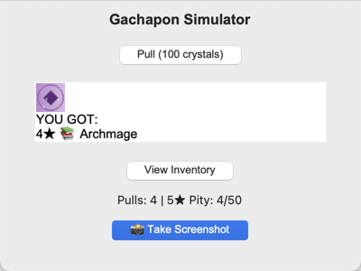

# Gachapon Simulator

A Python-based gachapon game with a graphical interface featuring collectible characters with different rarity tiers.

 *[Optional: Add screenshot later]*

## Features

- 🎮 Graphical user interface (GUI) using Tkinter
- 🌟 Three rarity tiers (3★, 4★, 5★) with different probabilities
- 🛡️ Pity system guaranteeing 5★ after 50 unsuccessful pulls
- 📦 Inventory tracking system
- 🎨 Custom generated sprites with tier-specific designs
- 🔊 Sound feedback for rare pulls
- 📊 Real-time pull statistics

## Requirements

- Python 3.6+
- Pillow (PIL Fork)
- playsound (for audio playback)

## Installation

1. Clone the repository:

```bash
git clone https://github.com/yourusername/gachapon-simulator.git
cd gachapon-simulator
```

```bash
pip install Pillow playsound PyObjC
```

# How to Play

1. Run the game:
```bash
python gachapon.py
```

2. Interface controls:
- **Pull Button**: Spend virtual currency for a random character
- **Inventory Button**: View collected characters and counts
- **Stats Display**: Shows total pulls and pity counter progress

3. Game mechanics:
- Base rates: 3★ (70%), 4★ (25%), 5★ (5%)
- Every 50 pulls without a 5★ guarantees a 5★ on next pull
- Inventory automatically tracks all obtained characters

## Credits

- Developed by Ghost
- Built with Python's Tkinter GUI toolkit
- Uses Pillow (PIL Fork) for image processing
- Emoji icons provided by Unicode Consortium

## License

MIT License - see [LICENSE](LICENSE) file for details
